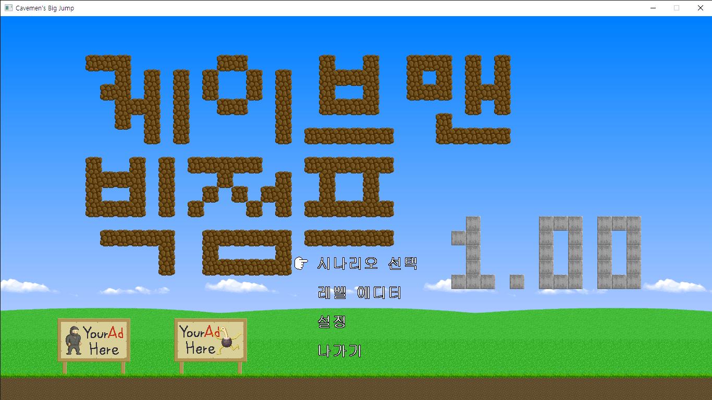

# Cavemen's Big Jump 한국어 패치
   
[다른 스크린샷 보기](screenshot.md)   
Cavemen's Big Jump 한국어 패치입니다.   
   
개발자 트위터: [일본어](https://twitter.com/kyokz_jp) / [영어](https://twitter.com/kyokz_en)
## 주의
* 간혹 __신세계로!__ 와 __붙잡힌 원시인(쉬움)__ 을 난이도 차이라고 오해하시는데, __붙잡힌 원시인__ 은 프리퀄입니다. 본편은 __신세계로__ 가 맞습니다.
* 저는 이걸 깰 실력이 없어서, 게임이 실행되는가만 테스트하고 플레이는 못했습니다. 그렇기에 여러분들의 피드백이 절실히 필요합니다.
## 다운로드
[Releases](https://github.com/boutoron2685/Cavemens-Big-Jump-Korean/releases)를 확인해주세요.

## 적용 방법
Cavemen's Big Jump 1.0이 필요합니다.
* 다운로드: [미국](https://kyokz.itch.io/cavemens-big-jump)/[일본](https://freegame-mugen.jp/action/game_6627.html)
* 이는 단순한 홈페이지 언어 차이입니다. 게임은 기본적으로 영어/일본어가 포함되어 있습니다.
## 제보
오역이나 패치 후 플레이에 문제가 생기셨다면, New issue를 생성해주시기 바랍니다.

## 패치노트
* 1.1 
  * 한글깨짐으로 인한 수정
* 1.2
  * 챕터 엔화기호 출력으로 인한 수정
* 1.3
  * 일부 챕터명을 변경하였습니다
    * __바늘투성이 동굴(針だらけの洞窟)__ 을 __가시투성이 동굴__ 로 변경했습니다.
    * __동굴미아(迷いの洞窟)__ 를 __미궁의 동굴__ 로 변경했습니다.
    * __야만인의 나라에 온 걸 환영합니다(ようこそ蛮族の郷へ)__ 는 개발년도를 파악해 밈을 반영해 __[어서와 야만인 나라에](https://www.youtube.com/watch?v=wbi7JDIoh0E)__ 로 변경했습니다.
    * __시카바네산(シカバネの山)__ 명칭을 __시체의 산__ 으로 변경했습니다.
  * 일부 오탈자 및 어색한 문장 다시 수정했습니다.
## 문제점
* 각 텍스트 문단마다 일정 바이트를 넘으면 오류가 납니다.(""를 쓸 수 있는 문장이거나, 문장을 줄여 해결)
* 원래는 정식 버전에 한국어 추가를 부탁하기 위해 한국어 코드를 따로 추가했었습니다**만,** 게임 클라이언트가 다중 언어를 표현하는 유니코드(UTF-8)를 지원을 하지 않아서 포기했습니다.
특이하게도 EUC-KR은 정상적으로 출력돼서 이 방식을 채택하고 있습니다.

추가적으로 제가 해결하지 못하는 문제가 발견되어 기재가 된다면, 해결하는 분이 계신다면 감사드립니다.
